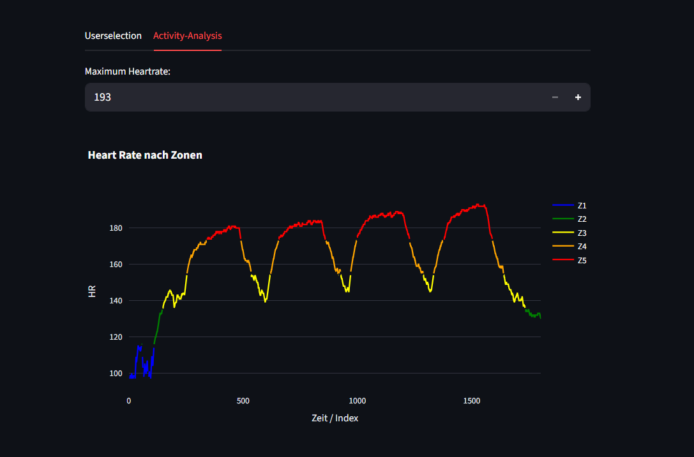

# programmieren_2_aufgabe_2-4

Dieses Repository beinhaltet den Code für Aufgabe 1 bis 4:

# Projektname

## Repository herunterladen
Zuerst das Repository klonen:

```bash
git clone https://github.com/LuisWalcherMCI/programmieren_2_aufgabe_2-4.git
```

Dann in den Projektordner wechseln:

```bash
cd DEIN-REPO
```

---

## Voraussetzungen
Benötigt:

- Python 3.10+
- PDM
- Git

### PDM installieren

```bash
curl -sSL https://pdm-project.org/install-pdm.py | python3 -
```

---

## Projekt starten

```bash
pdm run python main.py
```

---

## Virtuelle Umgebung aktivieren (optional)

```bash
pdm venv activate
```

---

## Neue Pakete installieren

```bash
pdm add paketname
```

Beispiel:

```bash
pdm add pandas
```

### Streamlit installieren

```bash
pdm add streamlit
```

### Plotly installieren

```bash
pdm add plotly
```

### Mehrere Pakete gleichzeitig installieren

```bash
pdm add streamlit plotly pandas
```

---

## Streamlit starten

```bash
pdm run streamlit run main.py
```
## Über diese App
Diese Anwendung wurde mit **Streamlit** entwickelt und bietet zwei Hauptfunktionen zur Verwaltung und Analyse von Nutzerdaten:

1. **Nutzerverwaltung:** Über ein Auswahlmenü kann ein spezifischer Nutzer ausgewählt werden, dessen Profilbild anschließend in der App angezeigt wird.
2. **Aktivitätsanalyse:** In einem separaten Bereich (Tab) erfolgt die detaillierte Auswertung sportlicher Aktivitäten (z. B. einer Radtour). Hierbei werden die Daten aus einer Datei (`activity.csv`) geladen, die Herzfrequenzmessungen verarbeitet und die Ergebnisse in Form von interaktiven Grafiken visuell dargestellt.

Die App dient dazu, komplexe Leistungsdaten intuitiv aufzubereiten und die Verteilung der Trainingsintensität (Herzfrequenz-Zonen) auf einen Blick erfassbar zu machen.

